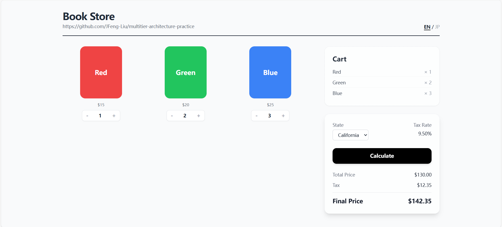
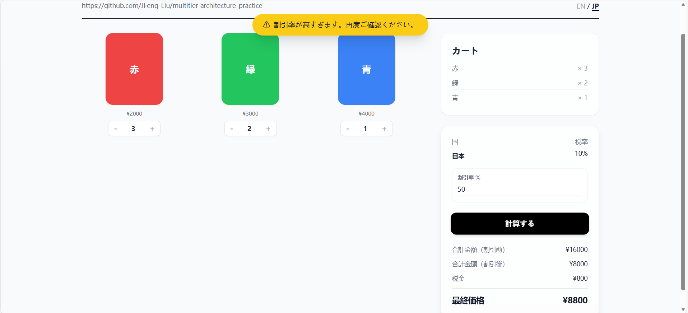
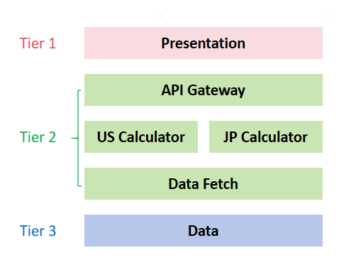

# Practice: Multitier Architecture

A multi-tier architecture system practice project. Mocks a distributed business scenario including high-precision calculations, API routing, and multi-layer validation.

## Features

A dynamic bookstore calculator with real-time backend integration.

* **Language & Logic Switching:** Seamlessly toggle between English (EN) and Japanese (JP) modes. The underlying calculation engine automatically adapts to the selected region's business rules.
* **US Mode (EN):** Calculate total prices based on different state tax rates.
  
* **Japan Mode (JP):** Apply custom discount rates to calculate final prices.
  
* **Smart Validation:** Built-in error and warning detection. It smoothly handles scenarios like an empty cart or unusually high discount rates with elegant UI feedback.

## Core Architecture

This project is built on the classic **3-Tier Architecture**, but it breaks down the Application layer (Tier 2) into three specialized sub-layers to handle complex enterprise logic.

* **Tier 1: Presentation**
  * A clean, responsive UI built with pure HTML, JavaScript, and Tailwind CSS. It manages user interactions and sends REST API requests.
* **Tier 2: Application (Backend Logic Services)**
  * **API Gateway:** The traffic controller. It receives requests, validates data, and routes them to the correct regional calculator.
  * **Calculation Layer:** The calculation core of the system. It handles the heavy lifting of math, taxes, and discounts.
  * **Repository Layer:** Dedicated strictly to data fetching. It isolates database queries, ensuring the Calculation layer only receives clean data objects.
* **Tier 3: Data**
  * Powered by SQLite for reliable, local data persistence.

## Technical Practice

* **Decoupling:** The API Gateway, Calculation Engine, and Data Repository are completely separated. This makes the system easy to test, maintain, and ready for future microservices migration.
* **Precision Calculation:** This system uses strings for all values during data transit, completely avoiding common "floating-point" math bugs in JavaScript.
* **Advanced Error Handling:** Instead of simple alerts, the system uses standardized error codes (like `E001` or `W001`). This allows multiple errors or warnings to be stacked and displayed on the frontend.
* **Region-Specific Logic:** Business rules are strictly isolated. The US logic handles state taxes, while the JP logic handles discounts. Updating one region's rules will never accidentally break the other.
* **Automated Testing (pytest):** A testing suite built with pytest ensures the calculation engine's reliability.

## Version & Roadmap

**v1.0 (Current):** Core multi-tier architecture, regional calculation logic, and responsive UI successfully implemented.

**(Coming Soon) Future Practice:**
* **Redis Integration:** Adding a caching layer to speed up data fetching and handle higher traffic.
* **Dockerization:** Packaging the application into containers for easy and consistent deployment.
* **Cloud Deployment:** Moving from local storage to a robust cloud platform.
